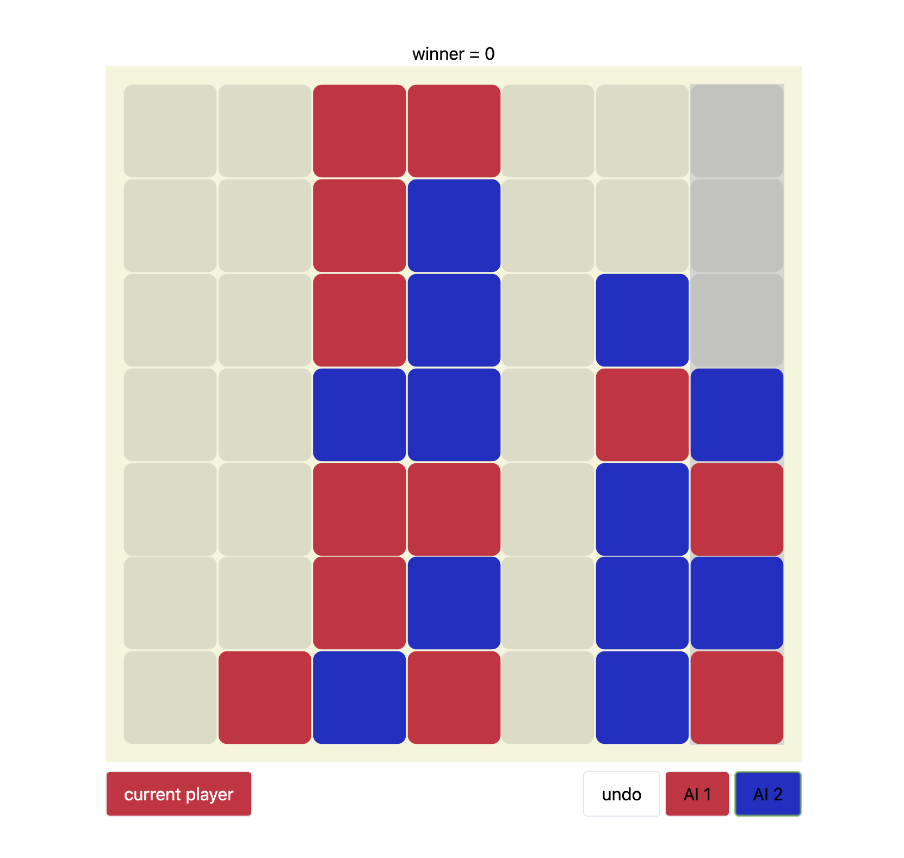

# 15 puzzle solver
- rust wasm 
- svelte
- A* ?



```rust
use wasm_bindgen::prelude::*;

#[cfg(feature = "wee_alloc")]
#[global_allocator]
static ALLOC: wee_alloc::WeeAlloc = wee_alloc::WeeAlloc::INIT;

#[wasm_bindgen]
extern "C" {
    fn alert(s: &str);
}

use std::fmt;
use std::option::{ Option };


const WIN_SIZE: usize = 4;
const BOARD_SIZE: usize = 7;
const MAX_DEPT: usize = 6;
const WIN_SCORE: f64 = 100000000.0;
const MAGIC_SCALE: [f64; WIN_SIZE + 1] = [0.0, 20.0, 1600.0, 3200000.0, WIN_SCORE];

#[derive(Debug, Copy, Clone)]
struct WinRate {
	winrate: f64,
	index: usize,
}

#[derive(Copy, Clone)]
struct Connect4 {
	board: [[u8; BOARD_SIZE]; BOARD_SIZE]
}

impl Connect4 {

	// constructure 
	fn new() -> Connect4 {
		return Connect4 {
			board: [[0; BOARD_SIZE]; BOARD_SIZE]
		};
	}
	fn from(inp: Vec<i32>) -> Connect4 {
    let mut game = Connect4::new();
    for i in 0..BOARD_SIZE {
      for j in 0..BOARD_SIZE {
        game.board[i][j] = match inp[i * BOARD_SIZE + j] {
          0|1|2 => inp[i * BOARD_SIZE + j] as u8,
          _ => panic!("input invalid")
        };
      }
    }
		return game;
	}

	// util
	fn is_valid_index(i: i32, j: i32) -> bool {
		return 0 <= i && i < BOARD_SIZE as i32 && 0 <= j && j < BOARD_SIZE as i32;
	}

	fn axis(&self) -> Vec<Vec<u8>> {
		let mut ans: Vec<Vec<u8>> = vec![];
		let directions: Vec<(i32, i32)> = vec![(0, 1), (1, 0), (1, 1), (1, -1)];
		for i in 0..BOARD_SIZE as i32 {
			for j in 0..BOARD_SIZE as i32 {
				for (di, dj) in directions.iter() {
					let linear = (0..WIN_SIZE as i32)
						.map(|x| (i + x * di, j + x * dj))
						.filter(|(ii, jj)| Connect4::is_valid_index(*ii, *jj))
						.map(|(ii, jj)| self.board[ii as usize][jj as usize])
						.collect::<Vec<u8>>();
					if linear.len() == WIN_SIZE {
						ans.push(linear);
					}
				}
			}
		}
		return ans;
	}

	// get winner if win
	fn winner(&self) -> Option<u8> {
		return match self.axis().iter()
		.find(|&items| items.iter().all(|&itm| itm == items[0] && itm != 0)) {
			Some(players) => Some(players[0]),
			None => None
		}
	}

	//  heuristuc value [-inf, inf]
	fn winrate(&self, player: u8) -> f64 {
		let mut p1 = 0.0;
		let mut p2 = 0.0;
		for items in self.axis() {
			let emp = items.iter().fold(0, |acc, &item| acc + (if item == 0 {1} else {0}));
			let pl1 = items.iter().fold(0, |acc, &item| acc + (if item == 1 {1} else {0}));
			let pl2 = items.iter().fold(0, |acc, &item| acc + (if item == 2 {1} else {0}));
			if emp + pl1 == WIN_SIZE { p1 += MAGIC_SCALE[pl1]; }
			if emp + pl2 == WIN_SIZE { p2 += MAGIC_SCALE[pl2]; }
			if pl1 == WIN_SIZE { return if player == 1 { WIN_SCORE } else { -WIN_SCORE }; }
			if pl2 == WIN_SIZE { return if player == 2 { WIN_SCORE } else { -WIN_SCORE }; }
		}
		let p1_winrate = p1 - p2;
		return match player {
			1 => p1_winrate,
			2 => -p1_winrate,
			_ => panic!("winrate must be player 1-2")
		}
	}
	
	fn get_valid_moves(&self) -> Vec<usize> {
		return self.board.iter()
			.enumerate()
			.filter(|(_, &arr)| { arr.last().unwrap() == &0 })
			.map(|(idx, _)| { idx })
			.collect();
	}

	// mutable game state
	fn push(&mut self, row: usize, player: u8) -> Result<(), ()> {
		if let Some(it) = self.board[row].iter_mut().find(|&&mut val| val == 0) {
			*it = player;
			Ok(())
		} else {
			Err(())
		}
	}
	fn pop(&mut self, row: usize) -> Result<u8, ()> {
		if let Some(it) = self.board[row].iter_mut().rev().find(|&&mut val| val != 0) {
			let itm = *it;
			*it = 0;
			Ok(itm)
		} else {
			Err(())
		}
	}

	// search for best move by minimax
 	fn _best_move(&mut self, player: u8, dept: usize) -> WinRate {
		let curr_winrate = self.winrate(player);
		if curr_winrate.abs() + 10000.0 >= WIN_SCORE || dept >= MAX_DEPT {
			return WinRate {
				index: BOARD_SIZE,
				winrate: curr_winrate,
			}
		}

		let valid_move = self.get_valid_moves();
		if valid_move.is_empty() {
			return WinRate {
				index: BOARD_SIZE,
				winrate: 0.0,
			};
		}

		let mut winrates = vec![];
		for row in valid_move {
			assert!(self.push(row, player).is_ok());
			let another_player_winrate = self._best_move(player ^ 3, dept + 1).winrate;
			let current_player_winrate = -another_player_winrate;
			assert_eq!(player, self.pop(row).unwrap());
			let winrate = WinRate {
				index: row,
				winrate: current_player_winrate
			};
			// alpha beta pruning
			if current_player_winrate + 100.0 >= WIN_SCORE {
				return winrate;
			} else {
				winrates.push(winrate);
			}
		}
		return winrates
			.iter()
			.max_by(|lhs, rhs| if lhs.winrate < rhs.winrate { std::cmp::Ordering::Less } else { std::cmp::Ordering::Greater })
			.unwrap()
			.clone();
	}
	fn best_move(&mut self, player: u8) -> usize {
		let res = self._best_move(player, 0);
		println!("winrate = {}", res.winrate);
		return res.index;
	}
}

impl fmt::Debug for Connect4 {
	fn fmt(&self, f: &mut fmt::Formatter) -> fmt::Result {
		for row in self.board.iter().enumerate() {
			writeln!(f, "{:?}", row);
		}
		Ok(())
	}
}
 
#[wasm_bindgen]
pub fn solve(inp: Vec<i32>, player: u8) -> usize {
  let mut game = Connect4::from(inp);
	return game.best_move(player);
}

#[wasm_bindgen]
pub fn winner(inp: Vec<i32>) -> u8 {
  let game = Connect4::from(inp);
	return game.winner().unwrap_or(0);
}

fn main() {
	let mut board = Connect4::new();
	for &player in [1, 2].iter().cycle() {
		let best_index = board.best_move(player);
		println!("{:?}", best_index);
		assert!(board.push(best_index, player).is_ok());
		println!("{:?}", board.get_valid_moves());
		println!("{:?}", board);
		if board.winner().is_some() {
			return
		}
	}
}

```